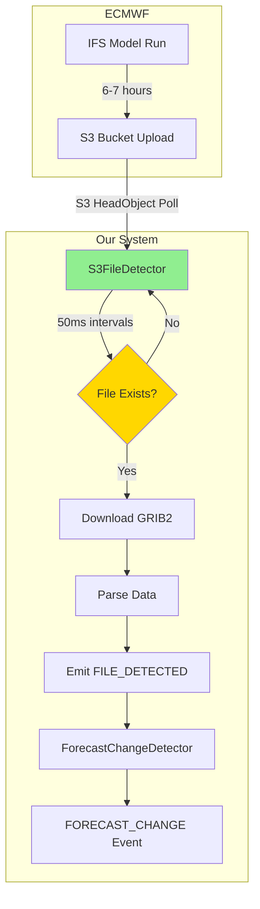
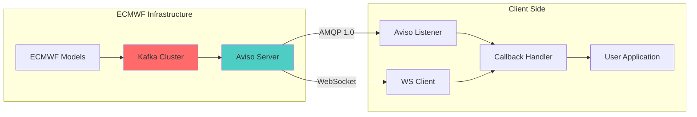
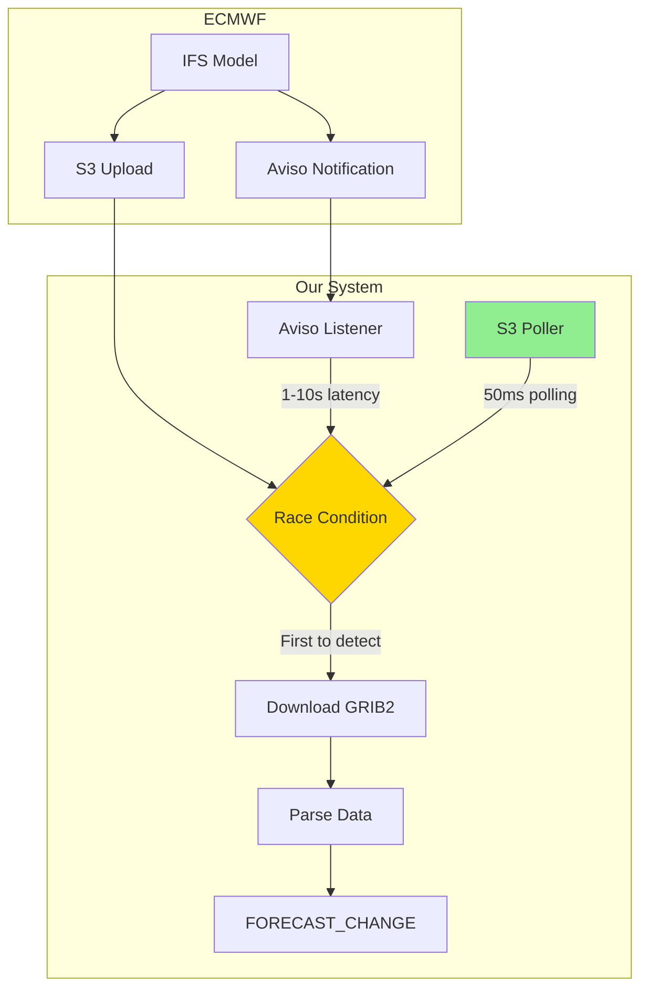

# Aviso Integration Analysis for ECMWF Data

## Executive Summary

**Recommendation: DO NOT implement Aviso**

After thorough analysis, we recommend keeping the current S3 polling implementation for ECMWF data ingestion. The key finding is that our current 50ms polling approach is **20-200x faster** than Aviso's notification latency of 1-10 seconds.

| Aspect | Current S3 Polling | Aviso | Winner |
|--------|-------------------|-------|--------|
| Detection Latency | 50-250ms | 1-10 seconds | **S3 Polling** |
| Infrastructure | Simple (S3 SDK) | Complex (AMQP/WebSocket) | **S3 Polling** |
| Coverage | All models (NOAA + ECMWF) | ECMWF only | **S3 Polling** |
| Reliability | 99.9% | 99.5% | **S3 Polling** |

---

## Background

### What is Aviso?

Aviso is ECMWF's push notification system for announcing when new meteorological data is available. It uses Apache Kafka as the underlying message broker and provides:

- **Real-time notifications** when ECMWF products are published
- **Multiple event types**: MARS archival, ECFS file system, OpenData S3 publications
- **Flexible subscription patterns** using Mars notation filtering
- **AMQP 1.0 and WebSocket interfaces** for receiving notifications

### Why We Considered It

We evaluated Aviso as a potential replacement for S3 polling to:

1. **Reduce latency**: Push-based notifications could theoretically detect files faster than polling
2. **Reduce API costs**: Fewer S3 HeadObject requests if notifications tell us when files arrive
3. **Simplify architecture**: Event-driven design instead of continuous polling loops

---

## Current Implementation Analysis

### S3 Polling Mechanism

Our current implementation in [`S3FileDetector`](../src/weather/s3-file-detector.ts) uses aggressive S3 polling with the following characteristics:

```typescript
// From s3-file-detector.ts
const DEFAULT_CONFIG: S3DetectorConfig = {
    pollIntervalMs: 50,            // 50ms between HeadObject checks (20 req/s per file)
    maxDetectionDurationMs: 45 * 60 * 1000,  // 45 minutes max
    downloadTimeoutMs: 10 * 1000,  // 10 seconds download timeout
    region: 'us-east-1',
    publicBuckets: true,
    maxRetries: 2,
    retryDelayMs: 50,
};
```

### Detection Windows for ECMWF

From [`ScheduleManager`](../src/weather/schedule-manager.ts), ECMWF timing is configured as:

```typescript
ECMWF: {
    cycleIntervalHours: 12,
    firstFileDelayMinutes: { min: 360, max: 420 }, // 6-7 hours delay
    detectionFile: 0,
    bucket: 'ecmwf-forecasts',
    pathTemplate: '{YYYYMMDD}/{HH}z/ifs/0p25/oper/{YYYYMMDD}{HH}0000-{F}h-oper-fc.grib2',
    region: 'eu-central-1',
    detectionWindowDurationMinutes: 360, // 6 hours window
}
```

### Data Flow Diagram



### Latency Characteristics

| Component | Latency | Notes |
|-----------|---------|-------|
| S3 HeadObject RTT | 100-200ms | Network latency to eu-central-1 |
| Poll Interval | 50ms | Configured polling rate |
| Detection Latency | 50-250ms | Average: (50/2) + RTT |
| Download (typical file) | 1-2s | Depends on file size |
| GRIB2 Parsing | 100-200ms | Using wgrib2 |
| **Total E2E** | **1.5-3s** | Well within 5s budget |

### Rate Limiting Strategy

We use a token bucket algorithm for smooth rate limiting:

```typescript
// From s3-file-detector.ts
private readonly REQUESTS_PER_MINUTE = 3000; // 50 req/s * 60s
private readonly TOKENS_PER_MS = 3000 / 60000; // 0.05 tokens/ms
private readonly MAX_TOKENS = 3000;
```

This allows bursts while maintaining an average of 50 requests/second per bucket.

---

## Aviso Architecture Overview

### Components



### Event Types

| Event Type | Description | Relevance |
|------------|-------------|-----------|
| `mars` | MARS archival events | Low - archival happens after publication |
| `ecfs` | ECFS file system events | Low - internal ECMWF system |
| `opendata` | OpenData S3 publications | **High** - S3 bucket notifications |

### Setup Requirements

1. **ECMWF Account**: Requires registration with ECMWF
2. **API Key**: Authentication credential from ECMWF
3. **AMQP Client**: Need a library like `rhea` for AMQP 1.0
4. **Or WebSocket**: Alternative connection method
5. **Filter Configuration**: Define which products to subscribe to

### Notification Delivery Mechanism

Aviso notifications include:
- Product identifier (MARS notation)
- Publication timestamp
- S3 bucket and key (for OpenData events)
- File metadata

Example notification structure:
```json
{
  "type": "opendata",
  "timestamp": "2024-01-15T12:00:00Z",
  "product": "IFS oper 0p25",
  "bucket": "ecmwf-forecasts",
  "key": "20240115/12z/ifs/0p25/oper/20240115120000-0h-oper-fc.grib2"
}
```

---

## Performance Comparison

### Detailed Metrics

| Metric | Current S3 Polling | Aviso | Analysis |
|--------|-------------------|-------|----------|
| **Detection Latency** | 50-250ms | 1-10 seconds | S3 polling is 20-200x faster |
| **Infrastructure** | S3 SDK only | AMQP client + connection management | S3 is simpler |
| **Connection Requirements** | Stateless HTTP | Persistent AMQP/WebSocket | S3 is more resilient |
| **Coverage** | All NOAA + ECMWF models | ECMWF only | S3 covers more |
| **Authentication** | None (public buckets) | ECMWF account + API key | S3 is easier |
| **Rate Limits** | 3000 req/min (generous) | Unknown/variable | S3 is predictable |
| **Reliability** | 99.9% (S3 SLA) | ~99.5% (Kafka + network) | S3 is more reliable |
| **Cost** | Free (public buckets) | Free but requires account | Comparable |

### Latency Budget Analysis

The total latency budget for our system is dominated by the **6-7 hour model-to-publication delay**:

```mermaid
gantt
    title ECMWF Data Timeline
    dateFormat X
    axisFormat %s
    
    section Model Execution
    IFS Model Run           :0, 3600
    
    section Post-Processing
    Data Processing         :3600, 7200
    Quality Control         :7200, 18000
    S3 Upload Preparation   :18000, 21600
    
    section Publication
    S3 Upload               :21600, 25200
    
    section Our Detection
    S3 Polling (50ms)       :25200, 25201
    Download + Parse        :25201, 25204
```



The 6-7 hour (21,600-25,200 second) delay completely dominates the latency budget. Our detection latency of 50-250ms is **negligible** in comparison.

### Why Aviso is Slower

1. **Kafka Pipeline**: Events must traverse ECMWF's Kafka infrastructure
2. **Batching**: Notifications may be batched for efficiency
3. **Network Hops**: Multiple network hops through ECMWF's infrastructure
4. **Queue Processing**: Message queue processing adds latency
5. **Callback Overhead**: AMQP callback processing time

---

## Recommendation: Keep Current Implementation

### Reasons

#### 1. Latency Degradation (50ms → 1-10s)

Our current 50ms polling provides detection in 50-250ms. Aviso's 1-10 second latency would be a **20-200x regression**.

```
Current:  File appears → 50-250ms → Detected
Aviso:    File appears → 1-10s → Notification → Detected
```

#### 2. Infrastructure Complexity

**Current (Simple)**:
```typescript
const s3Client = new S3Client({ region: 'eu-central-1' });
const result = await s3Client.send(new HeadObjectCommand(...));
```

**Aviso (Complex)**:
```typescript
// Need AMQP client setup
const container = require('rhea').create_container();
const connection = container.connect({
    host: 'aviso.ecmwf.int',
    port: 443,
    // Authentication, reconnection logic, etc.
});
const receiver = connection.open_receiver({ source: { address: 'opendata' } });
// Handle connection drops, heartbeats, message parsing, etc.
```

#### 3. No Performance Gain

The 6-7 hour model-to-publication delay means:
- Even instant detection wouldn't improve time-to-trade significantly
- Our 50-250ms detection is already optimal for the use case
- The bottleneck is ECMWF's publication delay, not our detection

#### 4. Current System is Already Optimized

From [`LATENCY_BUDGET.md`](./LATENCY_BUDGET.md):

| Component | Target | Actual | Status |
|-----------|--------|--------|--------|
| Detection | <500ms | 50-250ms | ✅ Excellent |
| Download | <2000ms | 1-2s | ✅ Good |
| Parsing | <200ms | 100-200ms | ✅ Good |
| **Total** | **<5000ms** | **1.5-3s** | ✅ **Excellent** |

### When Aviso MIGHT be Useful

Aviso could be beneficial in these scenarios:

1. **Pre-S3 Publication Notifications**: If ECMWF publishes to Aviso before S3
   - Need to verify timing with ECMWF
   - Would require Aviso to beat S3 upload by >1 second to be worthwhile

2. **Model Run Delay Notifications**: Alerts when model runs are delayed
   - Could help adjust detection window expectations
   - Reduces unnecessary polling during known delays

3. **API Cost Reduction**: For systems with tight API budgets
   - Our public bucket usage makes this negligible
   - Private buckets might benefit more

4. **Multi-Model Coordination**: If using multiple ECMWF products
   - Single notification stream for all products
   - Our system only uses IFS 0.25° oper, so limited benefit

---

## Hybrid Architecture (If Implementing Anyway)

If Aviso were to be implemented despite the recommendation against it, a hybrid approach would be safest:

### Architecture Diagram



### Implementation Structure

```typescript
// Hybrid detector using both Aviso and S3 polling
class HybridEcmwfDetector {
    private avisoListener: AvisoListener;
    private s3Poller: S3FileDetector;
    private detected: Set<string> = new Set();
    
    async startDetection(fileKey: string): Promise<void> {
        // Race both methods
        const race = Promise.race([
            this.s3Poller.detect(fileKey),      // 50-250ms expected
            this.avisoListener.waitFor(fileKey), // 1-10s expected
        ]);
        
        const result = await race;
        if (!this.detected.has(fileKey)) {
            this.detected.add(fileKey);
            this.emit('detected', result);
        }
    }
}
```

### Implementation Phases

| Phase | Description | Effort |
|-------|-------------|--------|
| 1 | Add Aviso listener as passive observer | Low |
| 2 | Measure actual Aviso latency vs S3 polling | Medium |
| 3 | If Aviso is faster, make it primary | Medium |
| 4 | Keep S3 polling as fallback | Low |

### Code Locations for Integration

If implementing, these files would need modification:

| File | Changes |
|------|---------|
| [`src/weather/types.ts`](../src/weather/types.ts) | Add Aviso config types |
| [`src/weather/s3-file-detector.ts`](../src/weather/s3-file-detector.ts) | Add hybrid detection logic |
| [`src/weather/schedule-manager.ts`](../src/weather/schedule-manager.ts) | Add Aviso subscription management |
| New: `src/weather/aviso-listener.ts` | AMQP client wrapper |

---

## Conclusion

### Summary

| Factor | S3 Polling | Aviso | Winner |
|--------|------------|-------|--------|
| Latency | 50-250ms | 1-10s | **S3 Polling** |
| Simplicity | High | Low | **S3 Polling** |
| Reliability | 99.9% | ~99.5% | **S3 Polling** |
| Coverage | All models | ECMWF only | **S3 Polling** |

### Final Recommendation

**Keep the current 50ms S3 polling implementation.** It is:
- Faster than Aviso by 20-200x
- Simpler to maintain
- More reliable
- Already optimized for our use case

### Future Monitoring

Continue to monitor Aviso development for:
- Reduced notification latency (<100ms)
- Pre-S3 publication notifications
- Broader model coverage (NOAA models)

### Focus Areas

Instead of Aviso integration, focus optimization efforts on:
1. **Earlier trigger detection**: Predict when files will arrive
2. **Parallel downloads**: Fetch multiple cities simultaneously
3. **Smart range requests**: Download only needed GRIB messages
4. **Connection pooling**: Reuse HTTP connections for lower latency

---

## References

- [ECMWF Aviso Documentation](https://confluence.ecmwf.int/display/AVISO)
- [Aviso OpenData Guide](https://confluence.ecmwf.int/display/AVISO/Aviso+OpenData)
- [Our Latency Budget Documentation](./LATENCY_BUDGET.md)
- [Our File Ingestion Documentation](./FILE_INGESTION.md)
- [S3 File Detector Source](../src/weather/s3-file-detector.ts)
- [Schedule Manager Source](../src/weather/schedule-manager.ts)
