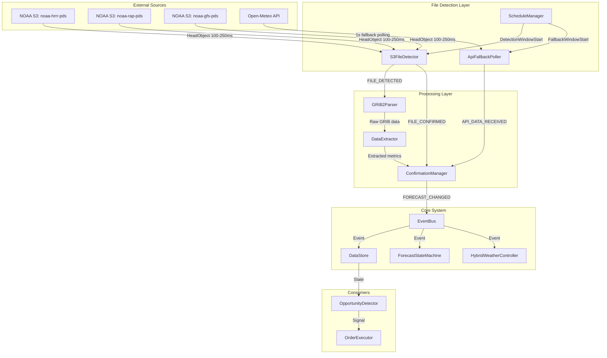
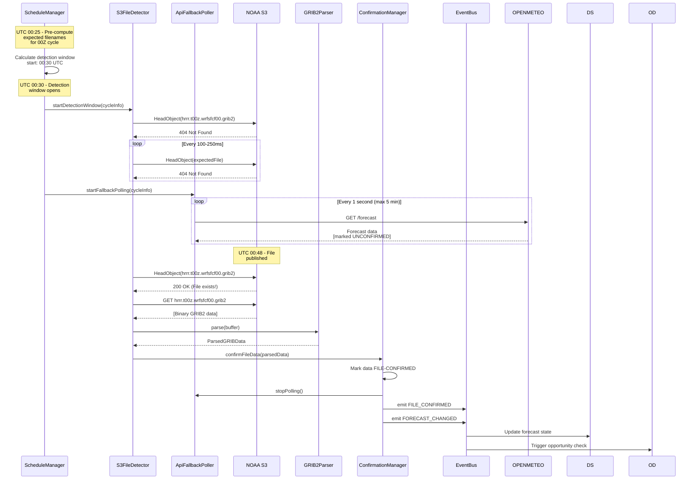
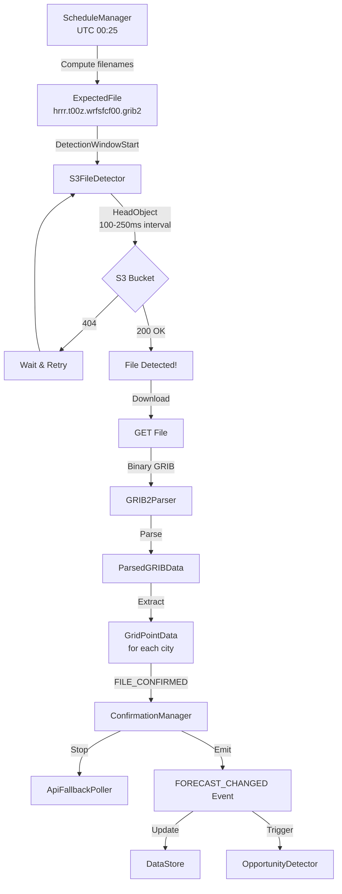
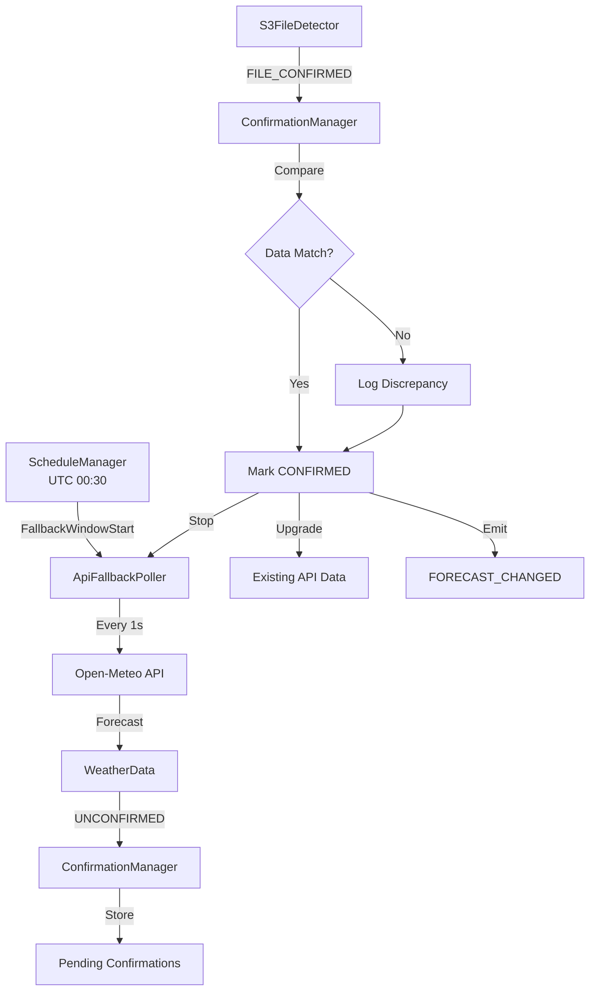
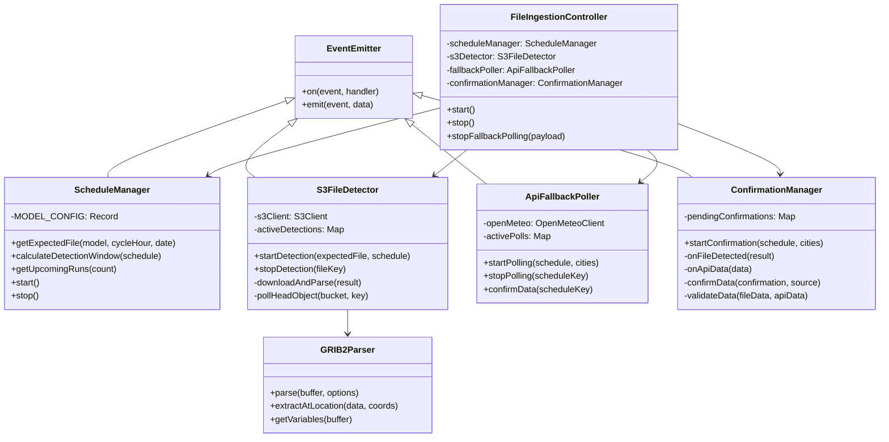

# NOAA Model File Ingestion Architecture

## Executive Summary

This document describes a low-latency weather forecast ingestion system that detects model file appearance from NOAA S3 buckets as the PRIMARY signal, with API polling as secondary fallback. The system achieves sub-5-second end-to-end latency from file appearance to signal emission.

### Key Design Principles
1. **File detection is primary**: S3 HeadObject checks drive the system timing
2. **API polling is secondary**: Open-Meteo serves as validation and fallback
3. **Single-file detection**: Poll only ONE expected file per model cycle (f00 or f03)
4. **Pre-computed schedules**: Calculate expected filenames before detection windows
5. **Immediate download**: On detection, download and parse immediately

---

## 1. Architecture Overview

### 1.1 System Context



### 1.2 Data Flow Sequence



---

## 2. Component Design

### 2.1 Schedule Manager

**Purpose**: Pre-compute expected filenames and manage detection windows for all models.

**Location**: `src/ingestion/schedule-manager.ts`

```typescript
/**
 * NOAA Model Run Schedule Information
 */
export interface ModelRunSchedule {
    model: 'HRRR' | 'RAP' | 'GFS';
    cycleHour: number;           // 0-23 for HRRR/RAP, 0|6|12|18 for GFS
    runDate: Date;               // UTC date of the run
    expectedPublishTime: Date;   // When we expect first files
    detectionWindowStart: Date;  // When to start S3 polling
    detectionWindowEnd: Date;    // When to stop S3 polling
    fallbackWindowStart: Date;   // When to start API fallback
    fallbackWindowEnd: Date;     // When to stop API fallback
}

/**
 * Expected S3 file path for a model run
 */
export interface ExpectedFile {
    bucket: string;
    key: string;
    model: 'HRRR' | 'RAP' | 'GFS';
    cycleHour: number;
    forecastHour: number;        // f00, f03, etc.
    fullUrl: string;
}

/**
 * Schedule Manager
 * Pre-computes expected filenames and manages detection windows
 */
export class ScheduleManager extends EventEmitter {
    private readonly HRRR_BUCKET = 'noaa-hrrr-pds';
    private readonly RAP_BUCKET = 'noaa-rap-pds';
    private readonly GFS_BUCKET = 'noaa-gfs-pds';

    // Model timing configurations
    private readonly MODEL_CONFIG: Record<string, ModelConfig> = {
        HRRR: {
            cycleIntervalHours: 1,
            firstFileDelayMinutes: { min: 30, max: 60 },
            detectionFile: 0,        // Check f00
            bucket: 'noaa-hrrr-pds',
            pathTemplate: 'hrrr.{YYYYMMDD}/conus/hrrr.t{HH}z.wrfsfcf{FF}.grib2',
        },
        RAP: {
            cycleIntervalHours: 1,
            firstFileDelayMinutes: { min: 30, max: 50 },
            detectionFile: 0,        // Check f00
            bucket: 'noaa-rap-pds',
            pathTemplate: 'rap.{YYYYMMDD}/rap.t{HH}z.awp130f{FF}.grib2',
        },
        GFS: {
            cycleIntervalHours: 6,
            firstFileDelayMinutes: { min: 3, max: 5 },
            detectionFile: 3,        // Check f003 (f00 often delayed)
            bucket: 'noaa-gfs-pds',
            pathTemplate: 'gfs.{YYYYMMDD}/{HH}/atmos/gfs.t{HH}z.pgrb2.0p25.f{FFF}',
        },
    };

    /**
     * Get expected file information for a model cycle
     */
    getExpectedFile(model: 'HRRR' | 'RAP' | 'GFS', cycleHour: number, runDate: Date): ExpectedFile;

    /**
     * Calculate detection window for a model cycle
     * Window starts shortly BEFORE expected publication time
     */
    calculateDetectionWindow(schedule: ModelRunSchedule): { start: Date; end: Date };

    /**
     * Get next N upcoming model runs across all models
     */
    getUpcomingRuns(count: number): ModelRunSchedule[];

    /**
     * Start monitoring schedules - emits 'detectionWindowStart' and 'fallbackWindowStart' events
     */
    start(): void;

    /**
     * Stop monitoring schedules
     */
    stop(): void;
}
```

### 2.2 S3 File Detector

**Purpose**: Poll S3 buckets using HeadObject to detect file appearance with minimal latency.

**Location**: `src/ingestion/s3-file-detector.ts`

```typescript
/**
 * S3 File Detection Configuration
 */
export interface S3DetectorConfig {
    pollIntervalMs: number;           // 100-250ms for S3 HeadObject
    maxDetectionDurationMs: number;   // Max time to poll (e.g., 30 min)
    downloadTimeoutMs: number;        // Timeout for file download
    region: string;                   // AWS region for S3
}

/**
 * File detection result
 */
export interface FileDetectionResult {
    expectedFile: ExpectedFile;
    detectedAt: Date;
    detectionLatencyMs: number;       // Time from window start to detection
    downloadUrl: string;
    fileSize: number;
    lastModified: Date;
}

/**
 * S3 File Detector
 * Uses HeadObject for existence checks, GET for download
 */
export class S3FileDetector extends EventEmitter {
    private s3Client: S3Client;
    private activeDetections: Map<string, DetectionContext>;
    private config: S3DetectorConfig;

    constructor(config: Partial<S3DetectorConfig>);

    /**
     * Start detecting a specific file
     * Returns immediately, emits 'detected' when file appears
     */
    startDetection(expectedFile: ExpectedFile, schedule: ModelRunSchedule): void;

    /**
     * Stop detecting a specific file
     */
    stopDetection(fileKey: string): void;

    /**
     * Download and parse a detected file
     */
    private async downloadAndParse(result: FileDetectionResult): Promise<ParsedGRIBData>;

    /**
     * Poll S3 with HeadObject
     */
    private async pollHeadObject(bucket: string, key: string): Promise<HeadObjectOutput | null>;

    // Events emitted:
    // - 'detected': FileDetectionResult
    // - 'downloaded': { result, data: ParsedGRIBData }
    // - 'error': { expectedFile, error }
    // - 'timeout': { expectedFile }
}
```

### 2.3 API Fallback Poller

**Purpose**: Secondary polling using Open-Meteo when file detection is delayed.

**Location**: `src/ingestion/api-fallback-poller.ts`

```typescript
/**
 * API Fallback Configuration
 */
export interface FallbackConfig {
    pollIntervalMs: number;           // 1000ms (1 second)
    maxDurationMs: number;            // 5 minutes max
    cities: CityLocation[];           // Cities to poll
}

/**
 * API Fallback Poller
 * Polls Open-Meteo as secondary signal
 */
export class ApiFallbackPoller extends EventEmitter {
    private openMeteo: OpenMeteoClient;
    private activePolls: Map<string, PollContext>;
    private config: FallbackConfig;

    constructor(openMeteo: OpenMeteoClient, config: FallbackConfig);

    /**
     * Start fallback polling for a model cycle
     * Data is marked as UNCONFIRMED until file confirmation
     */
    startPolling(schedule: ModelRunSchedule, cities: CityLocation[]): void;

    /**
     * Stop polling (called when file is confirmed)
     */
    stopPolling(scheduleKey: string): void;

    /**
     * Mark data as confirmed (upgrade from UNCONFIRMED)
     */
    confirmData(scheduleKey: string): void;

    // Events emitted:
    // - 'data': { schedule, city, data: WeatherData, confirmed: boolean }
    // - 'stopped': { scheduleKey }
}
```

### 2.4 GRIB2 Parser

**Purpose**: Parse downloaded GRIB2 files to extract weather variables.

**Location**: `src/ingestion/grib-parser.ts`

```typescript
/**
 * GRIB2 Variable Identifiers
 */
export enum GRIBVariable {
    TEMP_2M = 'TMP:2 m above ground',
    WIND_U_10M = 'UGRD:10 m above ground',
    WIND_V_10M = 'VGRD:10 m above ground',
    PRECIP_RATE = 'PRATE:surface',
    TOTAL_PRECIP = 'APCP:surface',
}

/**
 * Parsed GRIB2 data for a specific location
 */
export interface ParsedGRIBData {
    model: 'HRRR' | 'RAP' | 'GFS';
    cycleHour: number;
    forecastHour: number;
    validTime: Date;
    gridPoints: Map<string, GridPointData>;  // key: "lat,lon"
    metadata: {
        fileSize: number;
        downloadTimeMs: number;
        parseTimeMs: number;
    };
}

/**
 * Weather data at a specific grid point
 */
export interface GridPointData {
    coordinates: Coordinates;
    temperatureC: number;
    windSpeedMps: number;
    windDirection: number;
    precipitationRateMmHr: number;
    totalPrecipitationMm: number;
}

/**
 * GRIB2 Parser Interface
 * Uses grib2-simple or similar library
 */
export interface IGRIBParser {
    /**
     * Parse a GRIB2 buffer
     */
    parse(buffer: Buffer, options: ParseOptions): Promise<ParsedGRIBData>;

    /**
     * Extract data for specific coordinates (nearest neighbor)
     */
    extractAtLocation(data: ParsedGRIBData, coords: Coordinates): GridPointData | null;

    /**
     * Get available variables in the GRIB file
     */
    getVariables(buffer: Buffer): Promise<string[]>;
}

/**
 * GRIB2 Parser Implementation
 */
export class GRIB2Parser implements IGRIBParser {
    constructor();

    async parse(buffer: Buffer, options: ParseOptions): Promise<ParsedGRIBData>;
    extractAtLocation(data: ParsedGRIBData, coords: Coordinates): GridPointData | null;
    async getVariables(buffer: Buffer): Promise<string[]>;
}
```

### 2.5 Confirmation Manager

**Purpose**: Coordinate between file-based and API-based data, manage confirmation state.

**Location**: `src/ingestion/confirmation-manager.ts`

```typescript
/**
 * Data Confirmation State
 */
export type ConfirmationState = 'PENDING' | 'UNCONFIRMED' | 'FILE_CONFIRMED' | 'API_CONFIRMED';

/**
 * Confirmed Forecast Data
 */
export interface ConfirmedForecast {
    cityId: string;
    model: 'HRRR' | 'RAP' | 'GFS';
    cycleHour: number;
    forecastHour: number;
    state: ConfirmationState;
    fileData?: GridPointData;         // From GRIB file
    apiData?: WeatherData;            // From Open-Meteo
    confirmedAt?: Date;
    latencyMs: number;                // End-to-end latency
}

/**
 * Confirmation Manager
 * Coordinates file detection and API fallback
 */
export class ConfirmationManager extends EventEmitter {
    private pendingConfirmations: Map<string, ConfirmedForecast>;
    private fileDetector: S3FileDetector;
    private fallbackPoller: ApiFallbackPoller;

    constructor(fileDetector: S3FileDetector, fallbackPoller: ApiFallbackPoller);

    /**
     * Start confirmation tracking for a model cycle
     */
    startConfirmation(schedule: ModelRunSchedule, cities: CityLocation[]): void;

    /**
     * Handle file detection event
     */
    private onFileDetected(result: FileDetectionResult): void;

    /**
     * Handle API data event
     */
    private onApiData(data: FallbackDataEvent): void;

    /**
     * Confirm data and emit FORECAST_CHANGED
     */
    private confirmData(confirmation: ConfirmedForecast, source: 'file' | 'api'): void;

    /**
     * Compare file data with API data for validation
     */
    private validateData(fileData: GridPointData, apiData: WeatherData): boolean;

    // Events emitted:
    // - 'confirmed': ConfirmedForecast
    // - 'validated': { confirmation, differences }
    // - 'discrepancy': { confirmation, fileValue, apiValue }
}
```

---

## 3. Data Flow Detail

### 3.1 File Detection Flow



### 3.2 API Fallback Flow



---

## 4. City-to-Model Mapping

### 4.1 Target Cities Configuration

```typescript
/**
 * City to Model Mapping
 * Defines which NOAA models cover each city
 */
export const CITY_MODEL_MAPPING: Record<string, CityModelConfig> = {
    // CONUS/Southern Canada - HRRR + RAP + GFS
    'New York City': {
        primaryModels: ['HRRR', 'RAP'],
        fallbackModels: ['GFS'],
        hrrrGrid: { i: 500, j: 300 },  // Approximate HRRR grid indices
        priority: 'HIGH',
    },
    'Seattle': {
        primaryModels: ['HRRR', 'RAP'],
        fallbackModels: ['GFS'],
        priority: 'HIGH',
    },
    'Toronto': {
        primaryModels: ['HRRR', 'RAP'],  // Southern Canada covered by CONUS models
        fallbackModels: ['GFS'],
        priority: 'HIGH',
    },
    'Dallas': {
        primaryModels: ['HRRR', 'RAP'],
        fallbackModels: ['GFS'],
        priority: 'HIGH',
    },
    'Atlanta': {
        primaryModels: ['HRRR', 'RAP'],
        fallbackModels: ['GFS'],
        priority: 'HIGH',
    },
    'Miami': {
        primaryModels: ['HRRR', 'RAP'],
        fallbackModels: ['GFS'],
        priority: 'HIGH',
    },
    'Washington DC': {
        primaryModels: ['HRRR', 'RAP'],
        fallbackModels: ['GFS'],
        priority: 'HIGH',
    },
    'Chicago': {
        primaryModels: ['HRRR', 'RAP'],
        fallbackModels: ['GFS'],
        priority: 'HIGH',
    },
    'Los Angeles': {
        primaryModels: ['HRRR', 'RAP'],
        fallbackModels: ['GFS'],
        priority: 'HIGH',
    },

    // Global - GFS only
    'Buenos Aires': {
        primaryModels: ['GFS'],
        fallbackModels: [],
        priority: 'MEDIUM',
    },
    'Seoul': {
        primaryModels: ['GFS'],
        fallbackModels: [],
        priority: 'MEDIUM',
    },
    'London': {
        primaryModels: ['GFS'],
        fallbackModels: [],
        priority: 'MEDIUM',
    },
    'Ankara': {
        primaryModels: ['GFS'],
        fallbackModels: [],
        priority: 'MEDIUM',
    },
};

/**
 * Model coverage configuration
 */
export interface CityModelConfig {
    primaryModels: ('HRRR' | 'RAP' | 'GFS')[];
    fallbackModels: ('HRRR' | 'RAP' | 'GFS')[];
    hrrrGrid?: { i: number; j: number };  // Optional: pre-computed grid indices
    priority: 'HIGH' | 'MEDIUM' | 'LOW';
}
```

### 4.2 Model Schedule Matrix

| Model | Cycles (UTC) | First File Delay | Detection File | Bucket | Coverage |
|-------|--------------|------------------|----------------|--------|----------|
| HRRR | 00-23 (hourly) | 30-60 min | f00 | noaa-hrrr-pds | CONUS only |
| RAP | 00-23 (hourly) | 30-50 min | f00 | noaa-rap-pds | CONUS + S. Canada |
| GFS | 00, 06, 12, 18 | 3-5 min | f003 | noaa-gfs-pds | Global |

---

## 5. Integration with Existing System

### 5.1 EventBus Integration

New events to add to [`src/realtime/event-bus.ts`](src/realtime/event-bus.ts):

```typescript
// New event types for file-based ingestion
export type EventType =
    | 'FORECAST_TRIGGER'
    | 'FETCH_MODE_ENTER'
    | 'FETCH_MODE_EXIT'
    | 'PROVIDER_FETCH'
    | 'FORECAST_CHANGED'
    // New events:
    | 'FILE_DETECTED'
    | 'FILE_CONFIRMED'
    | 'API_FALLBACK_DATA'
    | 'DETECTION_WINDOW_START';

export interface FileDetectedEvent {
    type: 'FILE_DETECTED';
    payload: {
        model: 'HRRR' | 'RAP' | 'GFS';
        cycleHour: number;
        filename: string;
        detectedAt: Date;
        latencyMs: number;
    };
}

export interface FileConfirmedEvent {
    type: 'FILE_CONFIRMED';
    payload: {
        model: 'HRRR' | 'RAP' | 'GFS';
        cycleHour: number;
        cities: string[];
        confirmedAt: Date;
        endToEndLatencyMs: number;
    };
}

export interface DetectionWindowStartEvent {
    type: 'DETECTION_WINDOW_START';
    payload: {
        model: 'HRRR' | 'RAP' | 'GFS';
        cycleHour: number;
        expectedFile: string;
        windowStart: Date;
        windowEnd: Date;
    };
}
```

### 5.2 DataStore Integration

Extend [`src/realtime/data-store.ts`](src/realtime/data-store.ts) with file-based forecast tracking:

```typescript
/**
 * File-based forecast snapshot
 */
export interface FileForecastSnapshot extends ForecastSnapshot {
    source: 'HRRR' | 'RAP' | 'GFS';
    confirmationState: ConfirmationState;
    fileDetectionLatencyMs: number;
    endToEndLatencyMs: number;
    apiValidationData?: WeatherData;  // Open-Meteo data for comparison
}

/**
 * Extended DataStore methods
 */
export class DataStore {
    // Existing methods...

    /**
     * Update forecast from file-based source
     */
    updateFileForecast(marketId: string, snapshot: FileForecastSnapshot): void;

    /**
     * Get latest file-based forecast for a market
     */
    getFileForecast(marketId: string): FileForecastSnapshot | undefined;

    /**
     * Get confirmation state for a market
     */
    getConfirmationState(marketId: string): ConfirmationState;
}
```

### 5.3 HybridWeatherController Integration

Modify [`src/realtime/hybrid-weather-controller.ts`](src/realtime/hybrid-weather-controller.ts) to prioritize file detection:

```typescript
export class HybridWeatherController extends EventEmitter {
    // Existing properties...
    private fileIngestionController: FileIngestionController;

    constructor(
        stateMachine: ForecastStateMachine,
        dataStore: DataStore,
        providerManager?: WeatherProviderManager,
        weatherService?: WeatherService,
        fileIngestionController?: FileIngestionController  // New parameter
    ) {
        // Existing initialization...
        this.fileIngestionController = fileIngestionController || new FileIngestionController();
        this.setupFileIngestionListeners();
    }

    /**
     * Setup listeners for file-based ingestion events
     */
    private setupFileIngestionListeners(): void {
        // File detection drives mode transitions
        eventBus.on('FILE_CONFIRMED', (event) => {
            // Enter FETCH_MODE for affected cities
            for (const cityId of event.payload.cities) {
                this.stateMachine.enterFetchMode(cityId, 'file_confirmed');
            }

            // Stop API fallback polling
            this.fileIngestionController.stopFallbackPolling(event.payload);
        });

        // Detection window starts - prepare for file arrival
        eventBus.on('DETECTION_WINDOW_START', (event) => {
            // Reduce regular polling frequency to avoid conflicts
            this.reducePollingFrequency(event.payload.model);
        });
    }

    /**
     * Reduce polling frequency when file detection is active
     */
    private reducePollingFrequency(model: string): void {
        // Slow down Open-Meteo polling to every 5s instead of 1s
        // File detection will trigger immediate fetch when ready
    }
}
```

---

## 6. Class Hierarchy



---

## 7. Configuration

### 7.1 Environment Variables

```typescript
// src/config.ts additions
export const config = {
    // Existing config...

    // File Ingestion Configuration
    FILE_INGESTION: {
        ENABLED: process.env.FILE_INGESTION_ENABLED === 'true',
        S3_POLL_INTERVAL_MS: parseInt(process.env.S3_POLL_INTERVAL_MS || '150'),
        S3_MAX_DETECTION_MINUTES: parseInt(process.env.S3_MAX_DETECTION_MINUTES || '30'),
        API_FALLBACK_INTERVAL_MS: parseInt(process.env.API_FALLBACK_INTERVAL_MS || '1000'),
        API_FALLBACK_MAX_MINUTES: parseInt(process.env.API_FALLBACK_MAX_MINUTES || '5'),
        AWS_REGION: process.env.AWS_REGION || 'us-east-1',
    },

    // Model-specific timing adjustments
    MODEL_TIMING: {
        HRRR_EARLY_START_MINUTES: parseInt(process.env.HRRR_EARLY_START_MIN || '25'),
        RAP_EARLY_START_MINUTES: parseInt(process.env.RAP_EARLY_START_MIN || '25'),
        GFS_EARLY_START_MINUTES: parseInt(process.env.GFS_EARLY_START_MIN || '2'),
    },
};
```

### 7.2 Default Configuration Values

| Parameter | Default | Description |
|-----------|---------|-------------|
| S3_POLL_INTERVAL_MS | 150 | HeadObject poll interval (100-250ms range) |
| S3_MAX_DETECTION_MINUTES | 30 | Max time to poll S3 for a file |
| API_FALLBACK_INTERVAL_MS | 1000 | Open-Meteo poll interval during fallback |
| API_FALLBACK_MAX_MINUTES | 5 | Max time for API fallback polling |
| HRRR_EARLY_START_MINUTES | 25 | Start detection 25 min after cycle |
| RAP_EARLY_START_MINUTES | 25 | Start detection 25 min after cycle |
| GFS_EARLY_START_MINUTES | 2 | Start detection 2 min after cycle |

---

## 8. Performance Targets

### 8.1 Latency Budget

| Step | Target | Max |
|------|--------|-----|
| File publication to HeadObject 200 | 100ms | 250ms |
| HeadObject detection to download start | 50ms | 100ms |
| Download (typical 50MB GRIB) | 2000ms | 5000ms |
| GRIB parsing | 500ms | 1000ms |
| Data extraction & confirmation | 100ms | 200ms |
| Event emission to consumers | 50ms | 100ms |
| **Total end-to-end** | **<3s** | **<5s** |

### 8.2 Throughput Requirements

- HRRR: 24 cycles/day × 9 cities = 216 file detections/day
- RAP: 24 cycles/day × 9 cities = 216 file detections/day
- GFS: 4 cycles/day × 13 cities = 52 file detections/day
- **Total: ~484 detection events/day**

---

## 9. Error Handling

### 9.1 Failure Modes

| Scenario | Detection | Response |
|----------|-----------|----------|
| S3 HeadObject timeout | Retry with backoff | After 3 failures, rely on API fallback |
| File download failure | Log error, retry once | Use API fallback data |
| GRIB parse failure | Log error | Use API fallback data |
| File/API data mismatch | Log discrepancy | Use file data (authoritative) |
| API fallback timeout | Log warning | Continue with next cycle |

### 9.2 Circuit Breaker Pattern

```typescript
interface CircuitBreakerConfig {
    failureThreshold: number;      // 5 failures
    resetTimeoutMs: number;        // 60 seconds
    halfOpenMaxCalls: number;      // 3 test calls
}

class S3CircuitBreaker {
    private state: 'CLOSED' | 'OPEN' | 'HALF_OPEN';
    private failures: number;
    private lastFailureTime: Date;

    canExecute(): boolean;
    recordSuccess(): void;
    recordFailure(): void;
}
```

---

## 10. Monitoring & Observability

### 10.1 Metrics to Track

```typescript
interface IngestionMetrics {
    // Detection metrics
    detectionsTotal: Counter;
    detectionLatency: Histogram;      // Time from window start to detection
    detectionMisses: Counter;         // Files that weren't detected

    // Download metrics
    downloadDuration: Histogram;
    downloadSize: Histogram;
    downloadFailures: Counter;

    // Parse metrics
    parseDuration: Histogram;
    parseFailures: Counter;

    // Confirmation metrics
    confirmationsTotal: Counter;
    confirmationLatency: Histogram;   // End-to-end latency
    apiFallbackActivations: Counter;
    dataDiscrepancies: Counter;

    // S3 metrics
    s3HeadObjectLatency: Histogram;
    s3GetObjectLatency: Histogram;
}
```

### 10.2 Key Alerts

1. **Detection Miss**: File not detected within 60 min of expected time
2. **High Latency**: End-to-end latency >5 seconds
3. **Data Discrepancy**: File data differs from API by >2°F or >5% precip
4. **S3 Circuit Open**: S3 requests failing consistently
5. **Parse Failure**: GRIB parser unable to process downloaded file

---

## 11. Implementation Phases

### Phase 1: Core File Detection
- ScheduleManager implementation
- S3FileDetector with HeadObject polling
- Basic event emission

### Phase 2: GRIB Parsing
- GRIB2Parser integration
- Data extraction for target cities
- File-to-city mapping

### Phase 3: API Fallback
- ApiFallbackPoller implementation
- ConfirmationManager coordination
- Data validation logic

### Phase 4: Integration
- EventBus integration
- DataStore extensions
- HybridWeatherController updates

### Phase 5: Optimization
- Performance tuning
- Circuit breaker implementation
- Monitoring and alerting

---

## 12. File Structure

```
src/
├── ingestion/
│   ├── index.ts                    # Main exports
│   ├── schedule-manager.ts         # Model schedule calculation
│   ├── s3-file-detector.ts         # S3 HeadObject polling
│   ├── api-fallback-poller.ts      # Open-Meteo fallback
│   ├── confirmation-manager.ts     # Data coordination
│   ├── grib-parser.ts              # GRIB2 parsing
│   ├── file-ingestion-controller.ts # Main controller
│   └── types.ts                    # Ingestion-specific types
├── config.ts                       # Add FILE_INGESTION config
└── realtime/
    ├── event-bus.ts                # Add new event types
    ├── data-store.ts               # Add file forecast methods
    └── hybrid-weather-controller.ts # Add file ingestion integration
```

---

## Appendix A: S3 Path Templates

### HRRR
```
Bucket: noaa-hrrr-pds
Path: hrrr.{YYYYMMDD}/conus/hrrr.t{HH}z.wrfsfcf{FF}.grib2
Example: hrrr.20260201/conus/hrrr.t00z.wrfsfcf00.grib2
```

### RAP
```
Bucket: noaa-rap-pds
Path: rap.{YYYYMMDD}/rap.t{HH}z.awp130f{FF}.grib2
Example: rap.20260201/rap.t00z.awp130f00.grib2
```

### GFS
```
Bucket: noaa-gfs-pds
Path: gfs.{YYYYMMDD}/{HH}/atmos/gfs.t{HH}z.pgrb2.0p25.f{FFF}
Example: gfs.20260201/00/atmos/gfs.t00z.pgrb2.0p25.f003
```

---

## Appendix B: GRIB2 Variable Selection

### Required Variables

| Variable | GRIB Name | Level | Units |
|----------|-----------|-------|-------|
| Temperature | TMP | 2 m above ground | K |
| U Wind | UGRD | 10 m above ground | m/s |
| V Wind | VGRD | 10 m above ground | m/s |
| Precipitation Rate | PRATE | surface | kg/m²/s |
| Total Precipitation | APCP | surface | kg/m² |

### Variable Extraction
```typescript
// Calculate wind speed from U and V components
const windSpeedMps = Math.sqrt(u * u + v * v);
const windDirection = (Math.atan2(v, u) * 180 / Math.PI + 360) % 360;

// Convert temperature from Kelvin to Fahrenheit
const tempF = (tempK - 273.15) * 9/5 + 32;

// Convert precipitation rate to mm/hr
const precipMmHr = prateKgM2S * 3600;
```
