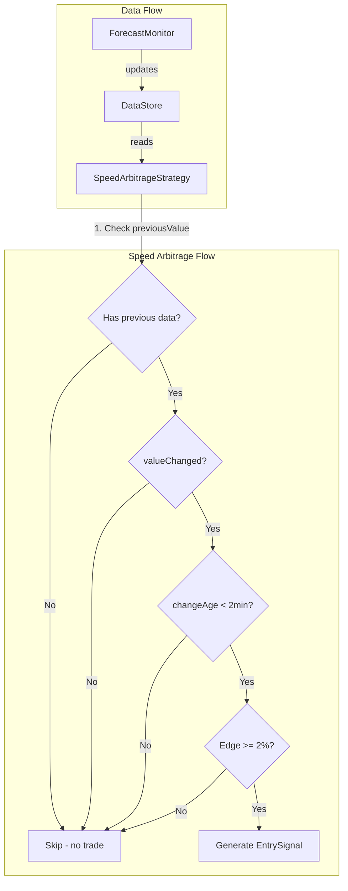
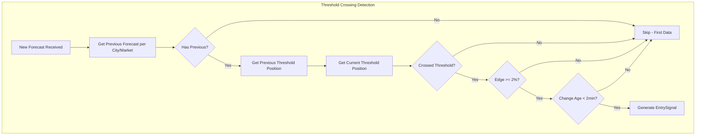
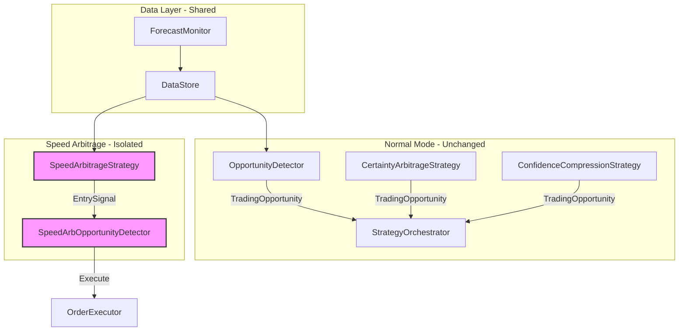

# Speed Arbitrage Redesign: Threshold-Crossing Detection

## Executive Summary

This document describes the redesign of the speed arbitrage strategy to trade on **forecast threshold crossings** rather than trading on the first weather data received.

### Current vs Desired Behavior

| Aspect | Current Behavior | Desired Behavior |
|--------|------------------|------------------|
| First Data | Trades on first forecast if edge exists | **Never** trades on first data |
| Trigger | Any significant forecast change | Forecast change that **crosses a threshold** |
| Example | Forecast 17°F for 16+ market → trade | Forecast 15→17°F for 16+ market → trade (crossed threshold) |
| Example | Forecast 15°F for 16+ market → no trade | Forecast 15→14°F for 16+ market → no trade (stayed below) |

---

## Current Implementation Analysis

### Architecture Overview



### Key Files

1. **[`src/strategy/speed-arbitrage.ts`](src/strategy/speed-arbitrage.ts)** - Main speed arbitrage logic
   - [`detectOpportunity()`](src/strategy/speed-arbitrage.ts:69) - Core detection method
   - Line 78: Checks `forecast.previousValue === undefined` to skip first data
   - Lines 80-83: Checks `valueChanged` and `changeAge`

2. **[`src/realtime/forecast-monitor.ts`](src/realtime/forecast-monitor.ts)** - Forecast data processing
   - [`processCityMarkets()`](src/realtime/forecast-monitor.ts:381) - Processes forecast updates
   - Lines 404-409: Tracks `isNew` market flag to identify first data

3. **[`src/realtime/data-store.ts`](src/realtime/data-store.ts)** - Data storage
   - [`updateForecast()`](src/realtime/data-store.ts:169) - Stores forecast snapshots
   - [`ForecastSnapshot`](src/realtime/types.ts:20) - Contains `previousValue`, `valueChanged`, `changeTimestamp`

4. **[`src/realtime/types.ts`](src/realtime/types.ts)** - Type definitions
   - [`ForecastSnapshot`](src/realtime/types.ts:20) - Forecast data structure

### Current Detection Logic

```typescript
// From speed-arbitrage.ts lines 69-88
detectOpportunity(marketId: string): EntrySignal | null {
    const state = this.store.getMarketState(marketId);
    if (!state?.lastForecast) return null;

    const forecast = state.lastForecast;
    
    // Must be a recent change (not first data)
    if (forecast.previousValue === undefined) return null;  // ← Skips first data

    const changeAge = now - forecast.changeTimestamp.getTime();
    if (!forecast.valueChanged || changeAge > MAX_CHANGE_AGE_MS) {
        return null;  // ← Requires valueChanged flag
    }
    
    // ... edge calculation and signal generation
}
```

### Problem with Current Implementation

The current implementation has **two issues**:

1. **First Data Detection is Fragile**: Relies on `previousValue === undefined` which works but is not explicit about the intent.

2. **Missing Threshold-Crossing Logic**: The strategy trades on ANY significant forecast change that creates edge, not specifically on threshold crossings.

**Example of the problem:**
- Market: "Will London be 16+ degrees?"
- Forecast 1: 15°F (below threshold) → No trade (correct)
- Forecast 2: 15.5°F (still below, but 0.5°F change) → Could trade if edge exists (incorrect - hasn't crossed threshold)
- Forecast 3: 17°F (above threshold) → Should trade (threshold crossed!)

---

## Proposed New Architecture

### Core Concept: Threshold-Crossing Detection

The redesigned speed arbitrage should only trade when:

1. **Previous forecast was on ONE side of the threshold**
2. **New forecast is on the OTHER side of the threshold**
3. **The crossing creates or increases edge**



### Data Structures

#### 1. Forecast History Tracker (New)

Add a dedicated tracker for per-city/market forecast history with threshold positions:

```typescript
// New interface to add to src/realtime/types.ts
interface ThresholdPosition {
    relativeToThreshold: 'above' | 'below' | 'at';
    distanceFromThreshold: number;  // Absolute distance in forecast units
    timestamp: Date;
}

interface ForecastThresholdSnapshot {
    marketId: string;
    cityId: string;
    threshold: number;  // The market's threshold in standardized units (°F)
    comparisonType: 'above' | 'below' | 'range';
    
    // Previous state
    previousForecastValue: number | undefined;
    previousThresholdPosition: ThresholdPosition | undefined;
    
    // Current state
    currentForecastValue: number;
    currentThresholdPosition: ThresholdPosition;
    
    // Crossing detection
    thresholdCrossed: boolean;
    crossingDirection: 'up' | 'down' | 'none';
    crossingTimestamp: Date | undefined;
    
    // Metadata
    changeAmount: number;
    changeTimestamp: Date;
}
```

#### 2. Per-City Forecast Cache (Enhance Existing)

The existing [`modelForecastCache`](src/realtime/data-store.ts:56) in DataStore can be enhanced:

```typescript
// Enhance the existing cache in DataStore
interface ModelForecastWithThresholds {
    value: number;
    timestamp: Date;
    
    // New: Track threshold positions for each market this city is involved in
    marketThresholds: Map<string, ThresholdPosition>;  // marketId -> position
}
```

### New Speed Arbitrage Logic

#### Updated [`detectOpportunity()`](src/strategy/speed-arbitrage.ts:69) Method

```typescript
detectOpportunity(marketId: string): EntrySignal | null {
    const state = this.store.getMarketState(marketId);
    if (!state?.lastForecast) return null;

    const market = state.market;
    const forecast = state.lastForecast;
    const now = Date.now();

    // ========================================
    // NEW: Threshold-Crossing Detection
    // ========================================
    
    // 1. Must have previous forecast data (not first data)
    if (forecast.previousValue === undefined) {
        return null;  // First data - never trade
    }
    
    // 2. Get threshold in standardized units (°F)
    let threshold = market.threshold;
    if (threshold === undefined) return null;
    if (market.thresholdUnit === 'C') {
        threshold = (threshold * 9 / 5) + 32;
    }
    
    // 3. Calculate threshold positions
    const previousPosition = this.getThresholdPosition(
        forecast.previousValue, 
        threshold, 
        market.comparisonType
    );
    const currentPosition = this.getThresholdPosition(
        forecast.forecastValue, 
        threshold, 
        market.comparisonType
    );
    
    // 4. Check if threshold was crossed
    const crossing = this.detectThresholdCrossing(
        previousPosition,
        currentPosition,
        market.comparisonType
    );
    
    if (!crossing.crossed) {
        // Threshold not crossed - no trade
        return null;
    }
    
    // ========================================
    // EXISTING: Edge calculation and validation
    // ========================================
    
    // 5. Check change age (must be recent)
    const changeAge = now - forecast.changeTimestamp.getTime();
    if (changeAge > MAX_CHANGE_AGE_MS) {
        return null;
    }
    
    // 6. Check if already captured
    if (this.isOpportunityCaptured(market.market.id, forecast.forecastValue)) {
        return null;
    }
    
    // 7. Calculate edge and generate signal
    // ... (existing edge calculation logic)
}

// New helper methods
private getThresholdPosition(
    value: number, 
    threshold: number, 
    comparisonType: 'above' | 'below' | 'range'
): ThresholdPosition {
    const distance = value - threshold;
    return {
        relativeToThreshold: distance > 0.5 ? 'above' : distance < -0.5 ? 'below' : 'at',
        distanceFromThreshold: Math.abs(distance),
    };
}

private detectThresholdCrossing(
    previous: ThresholdPosition,
    current: ThresholdPosition,
    comparisonType: 'above' | 'below' | 'range'
): { crossed: boolean; direction: 'up' | 'down' | 'none' } {
    // For 'above' markets: crossing UP (below → above) is bullish
    // For 'below' markets: crossing DOWN (above → below) is bullish
    
    if (previous.relativeToThreshold === current.relativeToThreshold) {
        return { crossed: false, direction: 'none' };
    }
    
    const crossedUp = previous.relativeToThreshold === 'below' && 
                      current.relativeToThreshold === 'above';
    const crossedDown = previous.relativeToThreshold === 'above' && 
                        current.relativeToThreshold === 'below';
    
    return {
        crossed: crossedUp || crossedDown,
        direction: crossedUp ? 'up' : crossedDown ? 'down' : 'none',
    };
}
```

### Integration Points

#### 1. ForecastMonitor Enhancement

Update [`processCityMarkets()`](src/realtime/forecast-monitor.ts:381) to calculate threshold positions:

```typescript
// In processCityMarkets(), after calculating forecastValue:

// Calculate threshold position for this market
const thresholdPosition = this.calculateThresholdPosition(
    forecastValue,
    market.threshold,
    market.thresholdUnit,
    market.comparisonType
);

// Add to snapshot
const snapshot: ForecastSnapshot = {
    // ... existing fields
    thresholdPosition,  // NEW
    previousThresholdPosition: currentState?.lastForecast?.thresholdPosition,  // NEW
    thresholdCrossed: this.detectCrossing(
        currentState?.lastForecast?.thresholdPosition,
        thresholdPosition
    ),  // NEW
};
```

#### 2. DataStore Enhancement

Add methods to query threshold crossing events:

```typescript
// New methods in DataStore
getMarketsWithThresholdCrossing(): ParsedWeatherMarket[] {
    const crossed: ParsedWeatherMarket[] = [];
    for (const [marketId, state] of this.markets.entries()) {
        if (state.lastForecast?.thresholdCrossed) {
            crossed.push(state.market);
        }
    }
    return crossed;
}

getThresholdCrossingAge(marketId: string): number | null {
    const state = this.markets.get(marketId);
    if (!state?.lastForecast?.thresholdCrossed) return null;
    return Date.now() - state.lastForecast.changeTimestamp.getTime();
}
```

---

## Isolation from Normal Mode

### Critical Requirement

Speed arbitrage must **NOT** interfere with normal mode operation. The normal mode (via [`OpportunityDetector`](src/bot/opportunity-detector.ts)) has high win rates and must continue unchanged.

### Isolation Strategy



### Implementation Guarantees

1. **Separate Signal Types**:
   - Normal mode produces `TradingOpportunity` objects
   - Speed arbitrage produces `EntrySignal` objects
   - These are processed independently

2. **Separate Captured Tracking**:
   - [`OpportunityDetector.capturedOpportunities`](src/bot/opportunity-detector.ts:37) - Normal mode
   - [`SpeedArbitrageStrategy.capturedOpportunities`](src/strategy/speed-arbitrage.ts:32) - Speed arbitrage
   - These maps are independent and don't interfere

3. **Separate Entry Points**:
   - Normal mode: [`StrategyOrchestrator.analyzeAllMarkets()`](src/strategy/strategy-orchestrator.ts:174)
   - Speed arbitrage: [`SpeedArbitrageStrategy.detectOpportunities()`](src/strategy/speed-arbitrage.ts:213)

4. **Configuration Flag**:
   - [`SPEED_ARBITRAGE_MODE`](src/config.ts:46) can disable speed arbitrage without affecting normal mode

### No Shared State Mutation

The only shared state is the **read-only** [`DataStore`](src/realtime/data-store.ts). Both modes:
- Read from `DataStore.getMarketState()`
- Read from `DataStore.getAllMarkets()`
- Do NOT modify each other's captured opportunities or signals

---

## Configuration Changes

### New Configuration Options

Add to [`src/config.ts`](src/config.ts):

```typescript
// Speed Arbitrage Configuration
export interface SpeedArbitrageConfig {
    // Enable/disable speed arbitrage (existing)
    SPEED_ARBITRAGE_MODE: boolean;
    
    // NEW: Require threshold crossing for speed arbitrage
    SPEED_ARB_REQUIRE_THRESHOLD_CROSSING: boolean;
    
    // NEW: Minimum distance from threshold to consider crossing valid
    // Prevents trading on noise near threshold (e.g., 15.9 → 16.1)
    SPEED_ARB_MIN_CROSSING_DISTANCE: number;  // Default: 0.5°F
    
    // NEW: Maximum age of crossing event to trade (existing MAX_CHANGE_AGE_MS)
    SPEED_ARB_MAX_CROSSING_AGE_MS: number;  // Default: 120000 (2 min)
    
    // Existing settings (unchanged)
    SPEED_ARB_MIN_SIGMA: number;  // Default: 0.5
    SPEED_ARB_MIN_EDGE: number;   // Default: 0.02 (2%)
}
```

### Environment Variables

```bash
# New environment variables
SPEED_ARB_REQUIRE_THRESHOLD_CROSSING=true
SPEED_ARB_MIN_CROSSING_DISTANCE=0.5
SPEED_ARB_MAX_CROSSING_AGE_MS=120000
```

---

## Implementation Steps

### Phase 1: Data Structure Updates

1. **Update [`src/realtime/types.ts`](src/realtime/types.ts)**:
   - Add `ThresholdPosition` interface
   - Add `thresholdCrossed`, `previousThresholdPosition` to `ForecastSnapshot`

2. **Update [`src/realtime/data-store.ts`](src/realtime/data-store.ts)**:
   - Add `getMarketsWithThresholdCrossing()` method
   - Add `getThresholdCrossingAge()` method

### Phase 2: Forecast Monitor Enhancement

3. **Update [`src/realtime/forecast-monitor.ts`](src/realtime/forecast-monitor.ts)**:
   - Add `calculateThresholdPosition()` helper
   - Add `detectThresholdCrossing()` helper
   - Update `processCityMarkets()` to populate threshold fields

### Phase 3: Speed Arbitrage Strategy Update

4. **Update [`src/strategy/speed-arbitrage.ts`](src/strategy/speed-arbitrage.ts)**:
   - Add `getThresholdPosition()` method
   - Add `detectThresholdCrossing()` method
   - Update `detectOpportunity()` to require threshold crossing
   - Add configuration for `SPEED_ARB_REQUIRE_THRESHOLD_CROSSING`

### Phase 4: Configuration

5. **Update [`src/config.ts`](src/config.ts)**:
   - Add new configuration options
   - Add environment variable parsing

### Phase 5: Testing

6. **Create unit tests**:
   - Test threshold crossing detection logic
   - Test that first data never triggers trades
   - Test that non-crossing changes don't trigger trades
   - Test isolation from normal mode

---

## Testing Strategy

### Unit Tests

```typescript
describe('SpeedArbitrageStrategy - Threshold Crossing', () => {
    it('should NOT trade on first forecast data', () => {
        // Setup: Market with threshold 16°F, first forecast 17°F
        // Expected: No signal (previousValue === undefined)
    });
    
    it('should NOT trade when forecast stays on same side of threshold', () => {
        // Setup: Previous 15°F, Current 15.5°F, Threshold 16°F
        // Expected: No signal (stayed below threshold)
    });
    
    it('should trade when forecast crosses threshold upward', () => {
        // Setup: Previous 15°F, Current 17°F, Threshold 16°F, above market
        // Expected: Signal generated (crossed from below to above)
    });
    
    it('should trade when forecast crosses threshold downward', () => {
        // Setup: Previous 17°F, Current 15°F, Threshold 16°F, below market
        // Expected: Signal generated (crossed from above to below)
    });
    
    it('should NOT trade on small threshold crossings (noise)', () => {
        // Setup: Previous 15.9°F, Current 16.1°F, Threshold 16°F
        // Expected: No signal (crossing distance < 0.5°F)
    });
    
    it('should NOT interfere with normal mode', () => {
        // Setup: Run both modes simultaneously
        // Expected: Normal mode signals unchanged
    });
});
```

### Integration Tests

```typescript
describe('Speed Arbitrage Integration', () => {
    it('should process forecast update and detect crossing', async () => {
        // 1. Add market to DataStore
        // 2. Process first forecast (no trade expected)
        // 3. Process second forecast that crosses threshold
        // 4. Verify signal generated
    });
});
```

---

## Risk Assessment

### Low Risk Changes

- Adding new fields to `ForecastSnapshot` (backward compatible)
- Adding new helper methods (no existing behavior change)
- Adding new configuration options (with safe defaults)

### Medium Risk Changes

- Modifying `detectOpportunity()` logic (core trading logic)
  - **Mitigation**: Feature flag to disable threshold crossing requirement
  - **Mitigation**: Comprehensive unit tests

### No Risk Changes

- Documentation updates
- Test additions

### Rollback Plan

If issues arise:
1. Set `SPEED_ARB_REQUIRE_THRESHOLD_CROSSING=false` to revert to old behavior
2. Set `SPEED_ARBITRAGE_MODE=false` to disable speed arbitrage entirely
3. Normal mode continues unaffected regardless of speed arbitrage state

---

## Summary

This redesign introduces **threshold-crossing detection** to the speed arbitrage strategy, ensuring it only trades when a forecast change meaningfully crosses a market's threshold. Key benefits:

1. **No first-data trades**: Explicit check prevents trading on initial forecast
2. **Threshold-crossing requirement**: Only trades when forecast crosses threshold
3. **Noise filtering**: Minimum crossing distance prevents trading on small fluctuations
4. **Complete isolation**: Normal mode continues unchanged
5. **Easy rollback**: Feature flags allow reverting to old behavior

The implementation is backward compatible and can be deployed incrementally with minimal risk to the existing high-performing normal mode.
