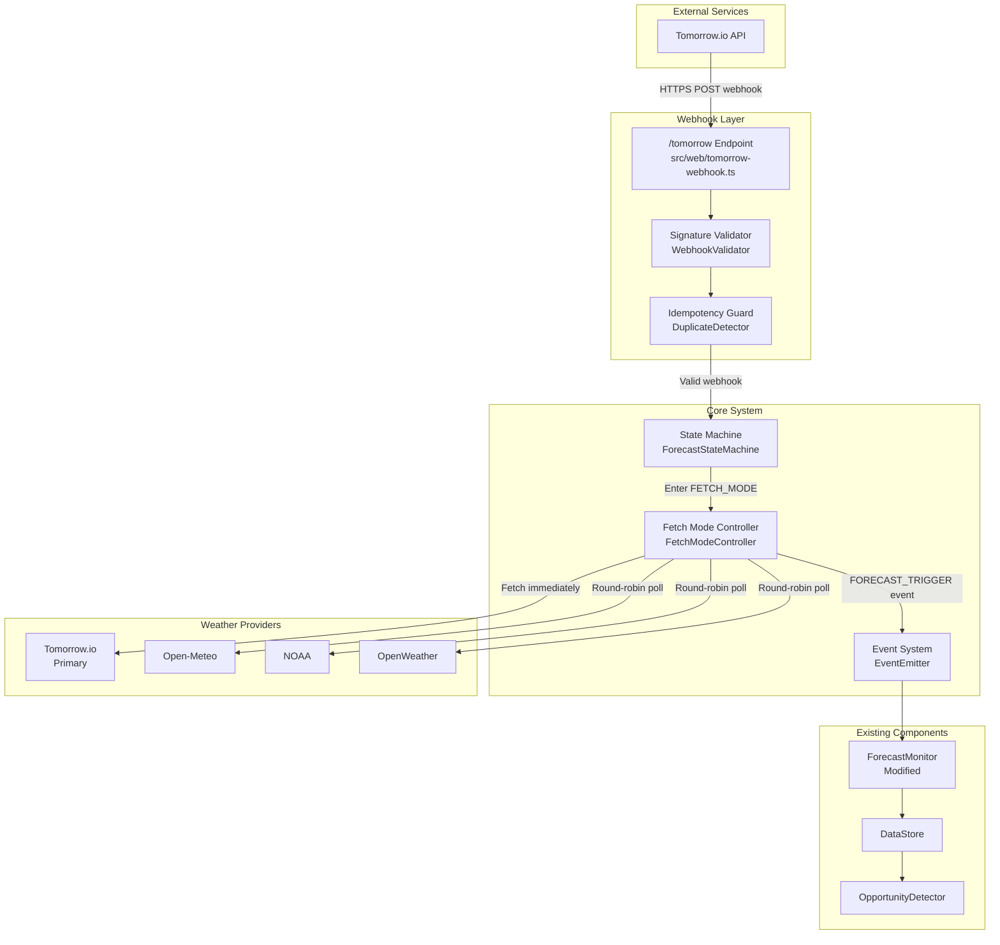
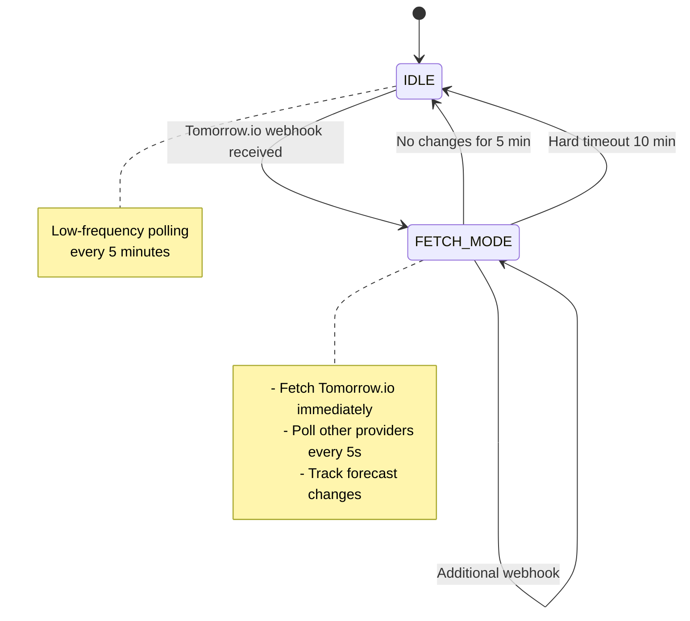
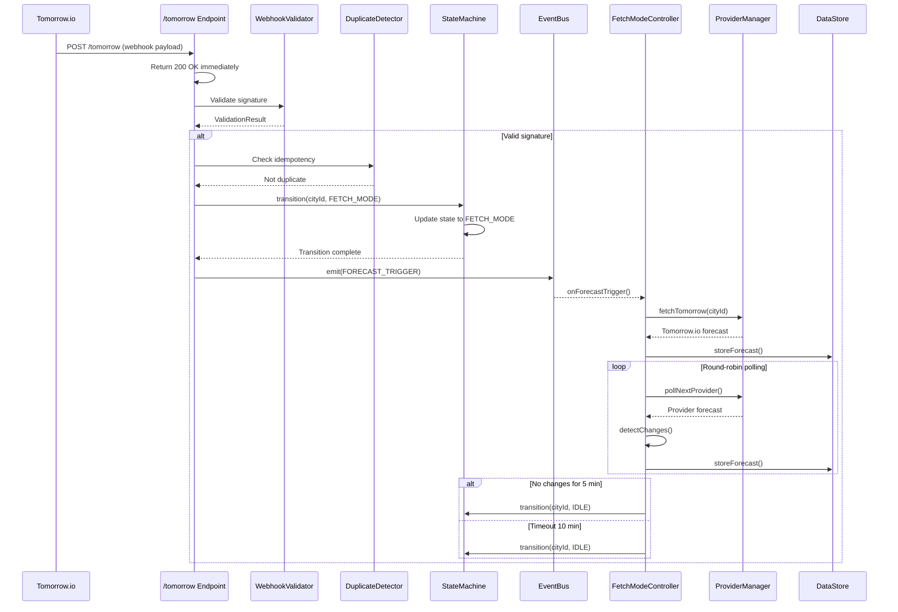
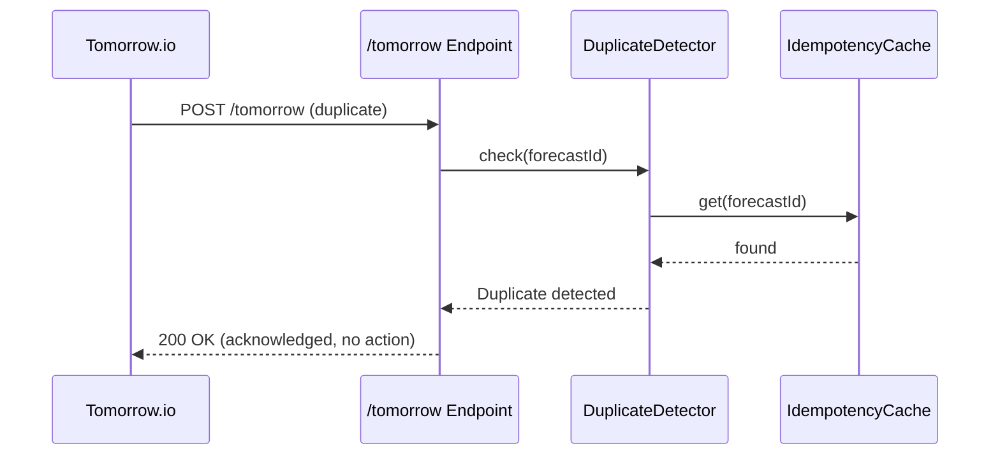

# Webhook-Based Forecast Detection Architecture

## Executive Summary

This document describes a webhook-triggered architecture to replace the current continuous polling system (12s regular, 6s high-priority) for weather forecast monitoring. Tomorrow.io webhooks serve as the primary trigger, with a state machine managing the transition between idle monitoring and active forecast fetching modes.

---

## 1. Architecture Overview

### 1.1 Current System

The existing [`ForecastMonitor`](src/realtime/forecast-monitor.ts:23) uses continuous polling:
- **Regular polling**: Every 12 seconds for standard cities
- **High-priority polling**: Every 6 seconds for volatile markets
- **Provider rotation**: Round-robin across multiple weather APIs

### 1.2 Proposed Webhook Architecture



---

## 2. Component Design

### 2.1 Webhook Endpoint (`/tomorrow`)

**Location**: [`src/web/tomorrow-webhook.ts`](src/web/tomorrow-webhook.ts)

**Responsibilities**:
- Accept HTTPS POST requests from Tomorrow.io
- Return 2xx response immediately (never block)
- Validate webhook authenticity using Tomorrow.io signature
- Parse payload and normalize location to `city_id`
- Emit `FORECAST_TRIGGER` event via internal event system

**Tomorrow.io Webhook Payload Structure**:
```typescript
interface TomorrowWebhookPayload {
    event: 'forecast.update' | 'forecast.alert';
    timestamp: string; // ISO 8601
    location: {
        lat: number;
        lon: number;
        city?: string;
    };
    data: {
        forecastId: string;
        updateType: 'temperature' | 'precipitation' | 'snow';
    };
}
```

**Idempotency Strategy**:
- Use `forecastId` + `timestamp` as deduplication key
- Store processed webhook IDs in Redis/memory with 1-hour TTL
- Return 200 for duplicates without processing

### 2.2 State Machine

**Location**: [`src/realtime/forecast-state-machine.ts`](src/realtime/forecast-state-machine.ts)

**States**:
- `IDLE`: Default state, minimal background polling
- `FETCH_MODE`: Active forecast fetching for a specific city

**State Transitions**:



**State Machine Implementation**:
```typescript
interface CityStateMachine {
    cityId: string;
    state: 'IDLE' | 'FETCH_MODE';
    fetchModeStartTime?: Date;
    lastForecastChange?: Date;
    providerStatus: Map<string, ProviderStatus>;
}

interface ProviderStatus {
    name: string;
    lastFetchTime: Date;
    lastError?: Date;
    consecutiveErrors: number;
    isActive: boolean;
}
```

### 2.3 Internal Event System

**Location**: [`src/realtime/event-bus.ts`](src/realtime/event-bus.ts)

**Event Types**:
```typescript
interface ForecastTriggerEvent {
    type: 'FORECAST_TRIGGER';
    payload: {
        provider: 'tomorrow.io';
        cityId: string;
        triggerTimestamp: Date;
        location: Coordinates;
    };
}

interface FetchModeEnterEvent {
    type: 'FETCH_MODE_ENTER';
    payload: {
        cityId: string;
        timestamp: Date;
    };
}

interface FetchModeExitEvent {
    type: 'FETCH_MODE_EXIT';
    payload: {
        cityId: string;
        timestamp: Date;
        reason: 'no_changes' | 'timeout';
    };
}

interface ProviderFetchEvent {
    type: 'PROVIDER_FETCH';
    payload: {
        cityId: string;
        provider: string;
        success: boolean;
        hasChanges: boolean;
    };
}
```

### 2.4 FETCH_MODE Controller

**Location**: [`src/realtime/fetch-mode-controller.ts`](src/realtime/fetch-mode-controller.ts)

**Behavior**:

1. **On Enter FETCH_MODE**:
   - Immediately fetch Tomorrow.io forecast for the city
   - Record entry timestamp
   - Start bounded polling window (max 10 minutes)
   - Reset provider error counters

2. **During FETCH_MODE**:
   - Poll other providers conditionally using round-robin
   - 5-second interval between provider polls
   - Stop polling a provider after 3 consecutive errors
   - Detect forecast changes using provider timestamps

3. **Provider Polling Strategy**:
   ```typescript
   const PROVIDER_POLL_INTERVAL_MS = 5000;
   const MAX_PROVIDER_ERRORS = 3;
   
   async function pollProvidersRoundRobin(cityId: string): Promise<void> {
       const providers = getActiveProviders(cityId);
       for (const provider of providers) {
           if (provider.consecutiveErrors >= MAX_PROVIDER_ERRORS) {
               continue; // Skip failing providers
           }
           
           try {
               const forecast = await provider.fetch(cityId);
               const hasChanges = detectChanges(cityId, forecast);
               
               if (hasChanges) {
                   updateLastChangeTimestamp(cityId);
               }
               
               provider.consecutiveErrors = 0;
           } catch (error) {
               provider.consecutiveErrors++;
               if (provider.consecutiveErrors >= MAX_PROVIDER_ERRORS) {
                   logger.warn(`Provider ${provider.name} disabled for ${cityId}`);
               }
           }
           
           await sleep(PROVIDER_POLL_INTERVAL_MS);
       }
   }
   ```

### 2.5 Exit Conditions

**Early Exit** (No changes for 5 minutes):
```typescript
const NO_CHANGE_EXIT_MINUTES = 5;

function shouldExitEarly(cityId: string): boolean {
    const lastChange = getLastForecastChange(cityId);
    if (!lastChange) return false;
    
    const minutesSinceChange = (Date.now() - lastChange.getTime()) / (60 * 1000);
    return minutesSinceChange >= NO_CHANGE_EXIT_MINUTES;
}
```

**Hard Timeout** (Always exit after 10 minutes):
```typescript
const FETCH_MODE_TIMEOUT_MINUTES = 10;

function shouldExitTimeout(cityId: string, entryTime: Date): boolean {
    const minutesInFetchMode = (Date.now() - entryTime.getTime()) / (60 * 1000);
    return minutesInFetchMode >= FETCH_MODE_TIMEOUT_MINUTES;
}
```

### 2.6 Fallback Safety

**IDLE Mode Polling**:
- Low-frequency round-robin polling every 5 minutes
- Protects against missed webhook deliveries
- Uses same provider rotation logic as FETCH_MODE

```typescript
const IDLE_POLL_INTERVAL_MS = 5 * 60 * 1000; // 5 minutes

class IdlePollingService {
    private pollInterval: NodeJS.Timeout | null = null;
    
    start(): void {
        this.pollInterval = setInterval(() => {
            this.pollAllCities();
        }, IDLE_POLL_INTERVAL_MS);
    }
    
    private async pollAllCities(): Promise<void> {
        const cities = dataStore.getAllCities();
        for (const city of cities) {
            // Skip cities in FETCH_MODE
            if (stateMachine.getState(city.id) === 'FETCH_MODE') {
                continue;
            }
            
            await this.pollCity(city.id);
        }
    }
}
```

---

## 3. Data Structures

### 3.1 Core Interfaces

```typescript
// src/web/types/webhook.types.ts

interface TomorrowWebhookPayload {
    event: 'forecast.update' | 'forecast.alert';
    timestamp: string;
    location: {
        lat: number;
        lon: number;
        city?: string;
    };
    data: {
        forecastId: string;
        updateType: 'temperature' | 'precipitation' | 'snow';
        severity?: 'low' | 'medium' | 'high';
    };
}

interface WebhookValidationResult {
    valid: boolean;
    error?: string;
    payload?: TomorrowWebhookPayload;
}

// src/realtime/types/state-machine.types.ts

type CityState = 'IDLE' | 'FETCH_MODE';

interface CityStateContext {
    cityId: string;
    state: CityState;
    fetchModeEntryTime?: Date;
    lastForecastChange?: Date;
    lastProviderFetch: Map<string, Date>;
    providerErrorCounts: Map<string, number>;
    processedWebhookIds: Set<string>; // For idempotency
}

interface StateTransition {
    from: CityState;
    to: CityState;
    trigger: 'webhook_received' | 'no_changes_timeout' | 'hard_timeout';
    timestamp: Date;
}

// src/realtime/types/fetch-mode.types.ts

interface FetchModeConfig {
    maxDurationMinutes: number;
    noChangeExitMinutes: number;
    providerPollIntervalMs: number;
    maxProviderErrors: number;
}

interface ProviderFetchResult {
    provider: string;
    success: boolean;
    forecast?: WeatherData;
    hasChanges: boolean;
    error?: string;
}

interface FetchModeSession {
    cityId: string;
    startTime: Date;
    providerResults: ProviderFetchResult[];
    changesDetected: boolean;
    exitReason?: 'no_changes' | 'timeout' | 'manual';
}
```

### 3.2 Configuration Types

```typescript
// src/config.ts additions

interface WebhookConfig {
    // Tomorrow.io webhook validation
    tomorrowWebhookSecret: string;
    
    // Idempotency settings
    webhookIdempotencyTtlMinutes: number;
    
    // State machine timing
    fetchModeTimeoutMinutes: number;
    noChangeExitMinutes: number;
    
    // Provider polling
    providerPollIntervalMs: number;
    maxProviderErrors: number;
    
    // Fallback polling
    idlePollIntervalMinutes: number;
}

// Add to existing Config interface
interface Config {
    // ... existing config ...
    
    // Webhook settings
    tomorrowWebhookSecret: string;
    webhookIdempotencyTtlMinutes: number;
    
    // State machine settings
    fetchModeTimeoutMinutes: number;
    noChangeExitMinutes: number;
    providerPollIntervalMs: number;
    maxProviderErrors: number;
    idlePollIntervalMinutes: number;
}
```

---

## 4. File Structure

### 4.1 New Files

```
src/
├── web/
│   ├── server.ts                          # Existing - add webhook route
│   ├── tomorrow-webhook.ts                # NEW: Webhook handler
│   ├── middleware/
│   │   └── webhook-validator.ts           # NEW: Signature validation
│   └── types/
│       └── webhook.types.ts               # NEW: Webhook type definitions
├── realtime/
│   ├── forecast-monitor.ts                # Existing - integrate with events
│   ├── forecast-state-machine.ts          # NEW: State machine implementation
│   ├── fetch-mode-controller.ts           # NEW: FETCH_MODE behavior
│   ├── event-bus.ts                       # NEW: Internal event system
│   ├── idle-polling-service.ts            # NEW: Fallback polling
│   └── types/
│       ├── state-machine.types.ts         # NEW: State machine types
│       └── fetch-mode.types.ts            # NEW: Fetch mode types
├── weather/
│   ├── provider-manager.ts                # Existing - extend for round-robin
│   ├── tomorrow-webhook-client.ts         # NEW: Tomorrow.io API client for webhooks
│   └── types.ts                           # Existing - add webhook types
└── config.ts                              # Existing - add webhook config
```

### 4.2 Modified Files

```typescript
// src/web/server.ts - Add webhook route
import { tomorrowWebhookHandler } from './tomorrow-webhook.js';

// Add to existing routes
app.post('/tomorrow', tomorrowWebhookHandler);

// src/realtime/forecast-monitor.ts - Subscribe to events
import { eventBus } from './event-bus.js';

export class ForecastMonitor {
    constructor() {
        // Subscribe to forecast trigger events
        eventBus.on('FORECAST_TRIGGER', this.handleForecastTrigger.bind(this));
        eventBus.on('FETCH_MODE_EXIT', this.handleFetchModeExit.bind(this));
    }
    
    private handleForecastTrigger(event: ForecastTriggerEvent): void {
        // React to webhook-triggered forecast updates
        this.evaluateTradingOpportunities(event.cityId);
    }
}

// src/config.ts - Add webhook configuration
export const config: Config = {
    // ... existing config ...
    
    // Webhook settings
    tomorrowWebhookSecret: getEnvVarOptional('TOMORROW_WEBHOOK_SECRET', ''),
    webhookIdempotencyTtlMinutes: getEnvVarNumber('WEBHOOK_IDEMPOTENCY_TTL_MINUTES', 60),
    
    // State machine settings
    fetchModeTimeoutMinutes: getEnvVarNumber('FETCH_MODE_TIMEOUT_MINUTES', 10),
    noChangeExitMinutes: getEnvVarNumber('NO_CHANGE_EXIT_MINUTES', 5),
    providerPollIntervalMs: getEnvVarNumber('PROVIDER_POLL_INTERVAL_MS', 5000),
    maxProviderErrors: getEnvVarNumber('MAX_PROVIDER_ERRORS', 3),
    idlePollIntervalMinutes: getEnvVarNumber('IDLE_POLL_INTERVAL_MINUTES', 5),
};
```

---

## 5. Integration Points

### 5.1 Integration with Existing ForecastMonitor

The existing [`ForecastMonitor`](src/realtime/forecast-monitor.ts:23) will be modified to:

1. **Subscribe to events** from the new event bus
2. **Maintain backward compatibility** with polling mode
3. **Delegate active fetching** to the FetchModeController when in FETCH_MODE

```typescript
// src/realtime/forecast-monitor.ts modifications

export class ForecastMonitor {
    private stateMachine: ForecastStateMachine;
    private fetchModeController: FetchModeController;
    private idlePollingService: IdlePollingService;
    private useWebhookMode: boolean;
    
    constructor(store: DataStore, options?: { useWebhookMode?: boolean }) {
        this.useWebhookMode = options?.useWebhookMode ?? false;
        
        if (this.useWebhookMode) {
            this.stateMachine = new ForecastStateMachine();
            this.fetchModeController = new FetchModeController(store, this.weatherService);
            this.idlePollingService = new IdlePollingService(store, this.weatherService);
            
            // Subscribe to events
            eventBus.on('FORECAST_TRIGGER', this.onForecastTrigger.bind(this));
            eventBus.on('FETCH_MODE_ENTER', this.onFetchModeEnter.bind(this));
            eventBus.on('FETCH_MODE_EXIT', this.onFetchModeExit.bind(this));
        }
    }
    
    start(): void {
        if (this.useWebhookMode) {
            this.idlePollingService.start();
        } else {
            // Legacy polling mode
            this.scheduleRegularPoll();
            this.scheduleHighPriorityPoll();
        }
    }
    
    private async onForecastTrigger(event: ForecastTriggerEvent): Promise<void> {
        const { cityId } = event.payload;
        
        // Transition to FETCH_MODE
        await this.stateMachine.transition(cityId, 'FETCH_MODE');
        
        // Start fetch mode controller
        await this.fetchModeController.enterFetchMode(cityId);
    }
}
```

### 5.2 Integration with WeatherProviderManager

Extend [`WeatherProviderManager`](src/weather/provider-manager.ts:20) to support round-robin polling during FETCH_MODE:

```typescript
// src/weather/provider-manager.ts additions

export class WeatherProviderManager {
    /**
     * Get providers for round-robin polling during FETCH_MODE
     * Excludes the primary provider (Tomorrow.io) which is fetched separately
     */
    getSecondaryProviders(): IWeatherProvider[] {
        return this.providers.filter(p => p.name !== 'tomorrow');
    }
    
    /**
     * Poll a specific provider with error tracking
     */
    async pollProvider(
        provider: IWeatherProvider, 
        coords: Coordinates
    ): Promise<{ success: boolean; data?: WeatherData; error?: string }> {
        try {
            await this.enforceRateLimit(provider.name);
            const data = await provider.getHourlyForecast(coords);
            this.recordSuccess(provider.name);
            return { success: true, data };
        } catch (error) {
            const statusCode = (error as any)?.response?.status;
            this.recordError(provider.name, statusCode);
            return { 
                success: false, 
                error: (error as Error).message 
            };
        }
    }
}
```

### 5.3 Integration with DataStore

The existing [`DataStore`](src/realtime/data-store.ts:10) will store:
- City state machine contexts
- Provider fetch results during FETCH_MODE
- Last forecast change timestamps

```typescript
// src/realtime/data-store.ts additions

export class DataStore {
    private cityStateContexts: Map<string, CityStateContext> = new Map();
    private lastForecastChanges: Map<string, Date> = new Map();
    
    updateCityStateContext(cityId: string, context: CityStateContext): void {
        this.cityStateContexts.set(cityId, context);
    }
    
    getCityStateContext(cityId: string): CityStateContext | undefined {
        return this.cityStateContexts.get(cityId);
    }
    
    recordForecastChange(cityId: string, timestamp: Date): void {
        this.lastForecastChanges.set(cityId, timestamp);
    }
    
    getLastForecastChange(cityId: string): Date | undefined {
        return this.lastForecastChanges.get(cityId);
    }
}
```

---

## 6. Configuration Requirements

### 6.1 Environment Variables

```bash
# Tomorrow.io Webhook Configuration
TOMORROW_WEBHOOK_SECRET=whsec_xxx           # Webhook signing secret

# State Machine Timing
FETCH_MODE_TIMEOUT_MINUTES=10               # Hard timeout for FETCH_MODE
NO_CHANGE_EXIT_MINUTES=5                    # Early exit if no changes

# Provider Polling
PROVIDER_POLL_INTERVAL_MS=5000              # 5 seconds between provider polls
MAX_PROVIDER_ERRORS=3                       # Disable provider after N errors

# Fallback Polling
IDLE_POLL_INTERVAL_MINUTES=5                # Low-frequency polling in IDLE

# Idempotency
WEBHOOK_IDEMPOTENCY_TTL_MINUTES=60          # How long to remember webhook IDs

# Feature Flag
USE_WEBHOOK_MODE=true                       # Enable webhook-based architecture
```

### 6.2 Tomorrow.io Webhook Setup

To configure Tomorrow.io webhooks:

1. **Create webhook endpoint** in Tomorrow.io dashboard:
   - URL: `https://your-domain.com/tomorrow`
   - Events: `forecast.update`, `forecast.alert`
   - Secret: Generate and set in `TOMORROW_WEBHOOK_SECRET`

2. **Configure locations** for webhook delivery:
   - Add all tracked cities
   - Set update frequency (recommend: immediate)

3. **Test webhook delivery**:
   ```bash
   curl -X POST https://api.tomorrow.io/v4/webhooks/test \
     -H "Authorization: Bearer $TOMORROW_API_KEY" \
     -d '{"url": "https://your-domain.com/tomorrow"}'
   ```

---

## 7. Sequence Diagrams

### 7.1 Webhook Reception → FETCH_MODE



### 7.2 Duplicate Webhook Handling



---

## 8. Error Handling & Resilience

### 8.1 Webhook Errors

| Error Type | Handling Strategy |
|------------|-------------------|
| Invalid signature | Return 401, log security event |
| Duplicate webhook | Return 200, skip processing |
| Malformed payload | Return 400, log error |
| City not found | Return 200, log warning |

### 8.2 Provider Errors

| Error Type | Handling Strategy |
|------------|-------------------|
| Rate limit (429) | Disable provider for backoff period |
| Timeout | Retry once, then mark error |
| 5xx errors | Mark error, try next provider |
| Max errors reached | Disable provider for city session |

### 8.3 State Machine Errors

| Error Type | Handling Strategy |
|------------|-------------------|
| Invalid transition | Log error, maintain current state |
| State timeout | Force transition to IDLE |
| Memory pressure | Clear old state contexts |

---

## 9. Monitoring & Observability

### 9.1 Metrics to Track

```typescript
interface WebhookMetrics {
    webhooksReceived: Counter;
    webhooksValid: Counter;
    webhooksDuplicate: Counter;
    webhooksInvalid: Counter;
    stateTransitions: Histogram;
    fetchModeDuration: Histogram;
    providerFetchLatency: Histogram;
    providerErrors: Counter;
}
```

### 9.2 Logging

```typescript
// Webhook received
logger.info('Webhook received', {
    cityId,
    forecastId,
    eventType,
    timestamp
});

// State transition
logger.info('State transition', {
    cityId,
    from: 'IDLE',
    to: 'FETCH_MODE',
    trigger: 'webhook_received'
});

// Fetch mode exit
logger.info('Fetch mode exit', {
    cityId,
    durationMs,
    reason: 'no_changes' | 'timeout',
    providersPolled,
    changesDetected
});
```

---

## 10. Migration Strategy

### Phase 1: Parallel Deployment
- Deploy webhook endpoint alongside existing polling
- Webhook triggers logging only (no action)
- Validate webhook delivery and idempotency

### Phase 2: Shadow Mode
- Webhook triggers FETCH_MODE
- Compare webhook results with polling results
- Measure latency and accuracy improvements

### Phase 3: Cutover
- Enable webhook as primary trigger
- Reduce polling frequency to fallback-only
- Monitor for missed webhooks

### Phase 4: Cleanup
- Remove legacy polling code
- Maintain idle polling as safety net

---

## 11. Security Considerations

### 11.1 Webhook Security
- Validate Tomorrow.io signature using HMAC-SHA256
- Use HTTPS only (reject HTTP webhooks)
- Implement IP allowlisting if Tomorrow.io provides IPs
- Rate limit webhook endpoint (e.g., 100 req/min per city)

### 11.2 Idempotency
- Store webhook IDs in Redis with TTL
- Prevent replay attacks using timestamp validation
- Reject webhooks older than 5 minutes

---

## 12. Summary

This webhook-based architecture provides:

1. **Immediate response** to forecast changes via Tomorrow.io webhooks
2. **Efficient resource usage** through state machine-managed fetching
3. **Resilience** via fallback polling and provider error handling
4. **Idempotency** to handle duplicate webhook deliveries
5. **Clean integration** with existing ForecastMonitor and DataStore

The architecture maintains backward compatibility while enabling a more responsive and resource-efficient forecast detection system.
